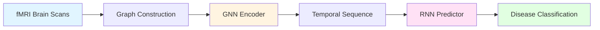

## Introduction

The Spatiotemporal Graph Neural Network (STGNN) framework combines graph-based spatial analysis with temporal sequence modeling to predict Alzheimer's disease progression from longitudinal fMRI brain connectivity data.

## Core Approach

The STGNN architecture addresses the challenge of understanding disease progression by modeling both:

<CardGroup cols={2}>
  <Card title="Spatial Relationships" icon="brain">
    Brain region connectivity patterns captured through graph neural networks
  </Card>
  <Card title="Temporal Evolution" icon="clock">
    How these patterns change over time using recurrent neural networks
  </Card>
</CardGroup>

## Architecture Pipeline

### Processing Flow

1. **Graph Construction**: Brain regions become nodes, functional connectivity becomes edges
2. **Spatial Encoding**: Graph Neural Networks extract connectivity patterns from each scan
3. **Temporal Sequencing**: Multiple visits per patient create time-ordered sequences
4. **Temporal Modeling**: Recurrent networks learn progression patterns across visits
5. **Classification**: Final prediction of disease state or conversion risk

## Key Features

<AccordionGroup>
  <Accordion title="Multi-Visit Temporal Modeling">
    The system processes multiple brain scans from the same patient over time, learning how connectivity patterns evolve. For patients with multiple visits, it uses all visits except the last as input to predict the final state (preventing data leakage). For single-visit patients, it predicts a configurable time horizon ahead (default 6 months).
  </Accordion>
  
  <Accordion title="Time-Aware Predictions">
    Optional temporal gap features can be incorporated into the GNN encoder, allowing the model to explicitly account for varying time intervals between visits. Time gaps are normalized using methods like log transformation to handle the wide range of follow-up durations.
  </Accordion>
  
  <Accordion title="Flexible GNN Architectures">
    Supports multiple graph convolution types (GraphSAGE, GCN, GAT) with configurable depth (2-5 layers), hidden dimensions (default 256), and activation functions (ReLU, ELU, GELU, LeakyReLU).
  </Accordion>
  
  <Accordion title="Multiple RNN Options">
    Three temporal predictor architectures available: LSTM (default), GRU, and vanilla RNN, all supporting bidirectional processing for richer temporal context.
  </Accordion>
</AccordionGroup>

## Data Flow Dimensions

Understanding tensor dimensions through the pipeline:

| Stage | Dimension | Description |
|-------|-----------|-------------|
| **Input Graph** | `[N, F]` | N brain regions, F features per region |
| **GNN Output** | `[B, 512]` | Batch size B, 512D embeddings (256×2 from mean+max pooling) |
| **Temporal Sequence** | `[B, T, 512]` | T visits per patient |
| **RNN Hidden State** | `[B, H]` | Hidden dimension H (default 64, ×2 if bidirectional) |
| **Classification Logits** | `[B, 2]` | Binary classification output |

## Clinical Application

The model predicts:
- **Current cognitive state**: Normal vs. impaired cognition
- **Future conversion risk**: Likelihood of progression to Alzheimer's disease
- **Temporal patterns**: How quickly connectivity patterns are deteriorating

<Info>
  **Temporal Gap Handling**: The system intelligently handles varying follow-up intervals. When `exclude_target_visit=True`, it learns to predict outcomes at specific future timepoints by incorporating normalized time-to-prediction features.
</Info>

## Training Strategy

<Steps>
  <Step title="Encoder Pre-training (Optional)">
    The GNN encoder can be pre-trained on static graph classification before temporal training
  </Step>
  <Step title="Temporal Fine-tuning">
    The full spatiotemporal model is trained end-to-end, optionally freezing the GNN encoder to preserve learned spatial representations
  </Step>
  <Step title="Cross-Validation">
    5-fold stratified cross-validation at the subject level ensures robust evaluation
  </Step>
</Steps>

## Performance Considerations

<Warning>
  **Memory Efficiency**: The system uses batched embedding computation - all graphs in a batch are processed in a single forward pass through the GNN encoder, then reshaped into per-subject sequences for the RNN.
</Warning>

### Optimization Techniques

- **Packed Sequences**: Variable-length sequences are efficiently packed to avoid wasted computation on padding
- **TopK Pooling**: Hierarchical graph coarsening retains the most salient nodes (default 30% minimum retention)
- **Focal Loss**: Addresses class imbalance by focusing on hard-to-classify examples (configurable α and γ)

## Next Steps

<CardGroup cols={2}>
  <Card title="System Architecture" icon="sitemap" href="/concepts/architecture">
    Deep dive into the two-stage architecture
  </Card>
  <Card title="Spatiotemporal Modeling" icon="chart-line" href="/concepts/spatiotemporal-modeling">
    Learn how spatial and temporal features combine
  </Card>
  <Card title="Graph Neural Networks" icon="project-diagram" href="/concepts/graph-neural-networks">
    Explore GNN layer types and configurations
  </Card>
  <Card title="Temporal Prediction" icon="forward" href="/concepts/temporal-prediction">
    Understand LSTM/GRU/RNN architectures
  </Card>
</CardGroup>