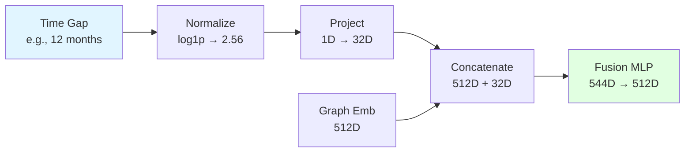

## Overview

Spatiotemporal modeling captures both **where** changes occur in the brain (spatial) and **when** they occur (temporal), providing a comprehensive view of disease progression.

```mermaid
flowchart TB
    subgraph "Patient Timeline"
        V1[Visit 1<br/>Month 0] --> V2[Visit 2<br/>Month 6]
        V2 --> V3[Visit 3<br/>Month 12]
        V3 --> V4[Visit 4<br/>Month 24]
    end
    
    subgraph "Spatial Encoding"
        V1 --> E1[Embedding 1<br/>512D]
        V2 --> E2[Embedding 2<br/>512D]
        V3 --> E3[Embedding 3<br/>512D]
        V4 --> E4[Embedding 4<br/>512D]
    end
    
    subgraph "Temporal Sequence"
        E1 --> S[Sequence<br/>[3, 512]]
        E2 --> S
        E3 --> S
    end
    
    subgraph "Prediction"
        S --> LSTM[LSTM]
        T[Time Gap:<br/>12 months] --> LSTM
        LSTM --> P[Predict Visit 4<br/>State]
    end
    
    style V1 fill:#e1f5ff
    style V2 fill:#e1f5ff
    style V3 fill:#e1f5ff
    style V4 fill:#ffe1e1
    style S fill:#fff4e1
    style P fill:#e1ffe1
```

## Spatial Feature Extraction

### Brain Graphs as Structured Data

Each fMRI scan is represented as a graph where:
- **Nodes**: Brain regions (typically 100-400 ROIs)
- **Edges**: Functional connectivity between regions
- **Node Features**: Statistical properties of each region

### GNN Spatial Processing

The Graph Neural Network extracts spatial patterns through message passing:

<Steps>
  <Step title="Local Aggregation">
    Each node aggregates information from its connected neighbors:
    
    ```python
    # GraphSAGE aggregation
    x = self.convs[i](x, edge_index)  # Aggregate neighbor features
    ```
    
    This captures **local connectivity patterns** - which brain regions are communicating.
  </Step>
  
  <Step title="Multi-Hop Propagation">
    With multiple layers (default 2-3), information propagates across the graph:
    
    - Layer 1: Immediate neighbors
    - Layer 2: 2-hop neighborhood
    - Layer 3: 3-hop neighborhood
    
    This captures **network-level organization** and **community structure**.
  </Step>
  
  <Step title="Hierarchical Pooling">
    TopK pooling progressively focuses on important regions:
    
    ```python
    x, edge_index, _, batch, perm, score = self.topk_pools[i](
        x, edge_index, batch=batch
    )
    ```
    
    This identifies **critical nodes** - regions most relevant for classification.
  </Step>
  
  <Step title="Global Representation">
    Dual pooling creates a graph-level feature vector:
    
    ```python
    x_mean = global_mean_pool(x, batch)  # Average pattern
    x_max = global_max_pool(x, batch)    # Peak activations
    x = torch.cat([x_mean, x_max], dim=1)  # [B, 512]
    ```
    
    This produces a **fixed-size embedding** representing the entire brain state.
  </Step>
</Steps>

<Info>
  **Spatial Encoding Output**: Each brain scan → 512-dimensional vector capturing connectivity fingerprint
</Info>

## Temporal Sequence Construction

### Multi-Visit Data Organization

The `TemporalDataLoader` organizes patient data into sequences:

```python
def _group_by_subject(self):
    """Group dataset indices by subject ID."""
    subject_groups = {}
    for idx in self.subject_indices:
        data = self.dataset[idx]
        sid = getattr(data, 'subj_id', None)
        base_id = sid.split('_run')[0] if '_run' in sid else sid
        subject_groups.setdefault(base_id, []).append(idx)
    return subject_groups
```

**Code reference**: `TemporalDataLoader.py:34-44`

### Sequence Construction Modes

<Tabs>
  <Tab title="Exclude Target (Default)">
    **Mode**: `exclude_target_visit=True`
    
    **Purpose**: Predict future state without data leakage
    
    **Logic**:
    ```python
    if len(subject_indices) > 1:
        # Use all visits except last as input
        input_indices = subject_indices[:-1]
        target_idx = subject_indices[-1]
        
        # Calculate time gap to predict
        last_input_data = self.dataset[input_indices[-1]]
        target_data = self.dataset[target_idx]
        time_to_predict = target_data.visit_months - last_input_data.visit_months
        
        # Label comes from target visit
        label = target_data.y.item()
    else:
        # Single visit: predict default horizon ahead (6 months)
        input_indices = subject_indices
        time_to_predict = self.single_visit_horizon
        label = self.dataset[subject_indices[0]].y.item()
    ```
    
    **Code reference**: `TemporalDataLoader.py:92-132`
    
    <Warning>
      This mode is crucial for **true future prediction**. Including the target visit in the input would allow the model to "see the future".
    </Warning>
  </Tab>
  
  <Tab title="Include All Visits">
    **Mode**: `exclude_target_visit=False`
    
    **Purpose**: Maximum temporal context, useful for state estimation
    
    **Logic**:
    ```python
    # Use all visits as input
    subject_lengths.append(len(subject_indices))
    
    # Calculate average time gap between consecutive visits
    if len(subject_indices) > 1:
        total_time_gap = 0
        gap_count = 0
        for i in range(len(subject_indices) - 1):
            curr_data = self.dataset[subject_indices[i]]
            next_data = self.dataset[subject_indices[i + 1]]
            total_time_gap += (next_data.visit_months - curr_data.visit_months)
            gap_count += 1
        avg_gap = total_time_gap / gap_count
    
    # Use last visit's label
    label = self.dataset[subject_indices[-1]].y.item()
    ```
    
    **Code reference**: `TemporalDataLoader.py:150-188`
  </Tab>
</Tabs>

### Temporal Gap Normalization

Time intervals vary widely (1 month to 5+ years). Normalization stabilizes training:

```python
from temporal_gap_processor import normalize_time_gaps

time_to_predict_normalized = normalize_time_gaps(
    np.array([time_to_predict]), 
    method=self.time_normalization  # 'log', 'minmax', 'buckets', 'raw'
)[0]
```

**Code reference**: `TemporalDataLoader.py:134-138`

<Tabs>
  <Tab title="Log Normalization">
    ```python
    normalized = np.log1p(time_gaps)  # log(1 + x)
    ```
    
    **Benefits**:
    - Compresses large time ranges
    - 6 months → 1.95, 12 months → 2.56, 24 months → 3.22
    - Preserves relative ordering
  </Tab>
  
  <Tab title="Min-Max Scaling">
    ```python
    normalized = (time_gaps - min_gap) / (max_gap - min_gap)
    ```
    
    **Benefits**:
    - Values in [0, 1] range
    - Linear scaling
    - Preserves absolute differences
  </Tab>
  
  <Tab title="Bucketing">
    ```python
    # Assign to predefined buckets (e.g., 0-6, 6-12, 12-24, 24+ months)
    bucket_idx = np.digitize(time_gaps, bucket_edges)
    ```
    
    **Benefits**:
    - Discrete time intervals
    - Robust to outliers
    - Interpretable categories
  </Tab>
</Tabs>

## Sequence Padding and Batching

Variable-length sequences must be padded for batch processing:

```python
def _pad_sequences(self, sequences, labels):
    batch_size = len(sequences)
    lengths = torch.tensor([seq.size(0) for seq in sequences], dtype=torch.long)
    max_len = lengths.max().item()
    embed_dim = sequences[0].size(1)  # 512
    
    # Create padded tensor
    padded = torch.zeros(batch_size, max_len, embed_dim, device=self.device)
    for i, seq in enumerate(sequences):
        padded[i, :seq.size(0)] = seq  # Fill real data
    
    labels_tensor = torch.tensor(labels, dtype=torch.long, device=self.device)
    return padded, lengths.to(self.device), labels_tensor
```

**Code reference**: `TemporalDataLoader.py:49-63`

<Info>
  **Sequence Lengths**: The `lengths` tensor allows the RNN to use packed sequences, ignoring padding and processing only real timesteps.
</Info>

## Temporal Pattern Learning

### RNN Processing of Sequences

The temporal model processes the sequence to learn progression patterns:

```python
if lengths is not None:
    # Pack sequences to skip padding
    fused_packed = nn.utils.rnn.pack_padded_sequence(
        fused, lengths.cpu(), batch_first=True, enforce_sorted=False
    )
    output_packed, (h_n, c_n) = self.lstm(fused_packed)
else:
    output, (h_n, c_n) = self.lstm(fused)

# Extract final hidden state (summary of entire sequence)
if self.bidirectional:
    final_hidden = torch.cat([h_n[-2], h_n[-1]], dim=1)
else:
    final_hidden = h_n[-1]
```

**Code reference**: `TemporalPredictor.py:66-82`

### What the RNN Learns

<AccordionGroup>
  <Accordion title="Trajectory Patterns">
    The RNN learns whether connectivity is:
    - **Stable**: Consistent patterns across visits
    - **Gradually declining**: Progressive degradation
    - **Rapidly deteriorating**: Fast conversion trajectory
    - **Fluctuating**: Noisy or recovering patterns
  </Accordion>
  
  <Accordion title="Visit-to-Visit Changes">
    The sequential processing captures:
    - Direction of change (improving vs. worsening)
    - Rate of change (slope of progression)
    - Acceleration (is decline speeding up?)
  </Accordion>
  
  <Accordion title="Long-Term Dependencies">
    LSTM's gating mechanisms remember:
    - Baseline connectivity from early visits
    - Cumulative changes over time
    - Critical transition points
  </Accordion>
</AccordionGroup>

## Time-Aware Enhancement

Optional temporal gap features explicitly inform the model about prediction horizon:

### GNN-Level Time Integration

```python
if self.use_time_features and time_to_predict is not None:
    # Project normalized time gap to 32D
    time_embedding = self.time_projection(time_to_predict)  # [B, 32]
    
    # Combine with graph embedding
    combined = torch.cat([graph_embedding, time_embedding], dim=1)  # [B, 544]
    final_embedding = self.fusion_layer(combined)  # [B, 512]
```

**Code reference**: `model.py:120-132`

### Design Rationale

<Card title="Why Small Time Dimension?" icon="question">
  Time features use only 32D (vs. 512D for graphs) to prevent temporal information from overwhelming spatial patterns. The brain connectivity patterns should drive predictions, with time serving as context.
</Card>

### Time Feature Flow



## Integration Example

Complete pipeline for a single patient:

<Steps>
  <Step title="Data Collection">
    Patient has 4 visits: Months 0, 6, 12, 24
    
    Labels: Normal, Normal, Normal, MCI (converted at Month 24)
  </Step>
  
  <Step title="Sequence Construction">
    With `exclude_target_visit=True`:
    - **Input**: Visits at months 0, 6, 12 (3 timesteps)
    - **Target**: MCI label from month 24
    - **Time gap**: 12 months (24 - 12)
  </Step>
  
  <Step title="Spatial Encoding">
    Each input visit is encoded by GNN:
    - Visit 0 → Embedding 1 [512D]
    - Visit 6 → Embedding 2 [512D]
    - Visit 12 → Embedding 3 [512D]
    
    Optional: Time gap (12 months) fused into each embedding
  </Step>
  
  <Step title="Temporal Processing">
    LSTM processes sequence [3, 512]:
    - Learns progression from Normal → Normal → Normal
    - Predicts future state 12 months ahead
    - Output: Hidden state [128D]
  </Step>
  
  <Step title="Classification">
    MLP classifier:
    - Input: Hidden state [128D]
    - Output: Logits [2D] → [Normal, MCI]
    - Prediction: MCI (correct!)
  </Step>
</Steps>

## Performance Optimization

### Batched Embedding Computation

Instead of encoding each visit separately:

```python
# Collect ALL graphs from ALL subjects in batch
all_data = []  # e.g., 3+4+2+5 = 14 graphs from 4 subjects
for subject in batch_subjects:
    for visit in subject_visits:
        all_data.append(graph_data)

# Single forward pass through GNN
big_batch = Batch.from_data_list(all_data)
all_embeddings = encoder(big_batch.x, big_batch.edge_index, big_batch.batch)

# Reshape back to per-subject sequences
for subject_idx in range(num_subjects):
    subject_sequence = [all_embeddings[i] for i in subject_indices]
    batch_sequences.append(torch.stack(subject_sequence))
```

**Code reference**: `TemporalDataLoader.py:194-224`

<Info>
  **Speedup**: Processing 14 graphs in a single batch is ~10x faster than 14 separate forward passes due to GPU parallelization.
</Info>

## Practical Considerations

<CardGroup cols={2}>
  <Card title="Missing Visits" icon="calendar-xmark">
    **Handled automatically**: Sequences include only available visits. The RNN processes variable-length sequences naturally via packed sequences.
  </Card>
  
  <Card title="Irregular Intervals" icon="clock">
    **Normalized**: Log transformation handles intervals from 1 month to 5+ years. Optional time features explicitly model intervals.
  </Card>
  
  <Card title="Single Visits" icon="user">
    **Prediction horizon**: Default 6 months ahead, configurable via `--single_visit_horizon`. Uses current state to predict future.
  </Card>
  
  <Card title="Sequence Length Limits" icon="list">
    **Truncation**: Set via `--max_visits` (default 10). Keeps most recent visits when patients have excessive follow-up.
  </Card>
</CardGroup>

## Evaluation Strategy

<Warning>
  **Subject-Level Splitting**: Train/val/test splits are done at the **subject level**, not visit level. All visits from a patient stay together, preventing data leakage.
</Warning>

```python
def get_kfold_splits(dataset, num_folds=5, seed=42):
    # Group by subject
    subject_labels = {}
    for subj_id, graphs in dataset.subject_graph_dict.items():
        subject_labels[subj_id] = graphs[0].y.item()  # Use first visit label
    
    # Stratified split on subjects
    skf = StratifiedKFold(n_splits=num_folds, shuffle=True, random_state=seed)
    for train_val_idx, test_idx in skf.split(subjects, labels):
        # Further split train_val into train and validation
        ...
```

**Code reference**: `main.py:117-150`

## Next Steps

<CardGroup cols={3}>
  <Card title="GNN Layers" icon="project-diagram" href="/concepts/graph-neural-networks">
    Spatial encoding details
  </Card>
  <Card title="RNN Architectures" icon="forward" href="/concepts/temporal-prediction">
    Temporal modeling options
  </Card>
  <Card title="Full Architecture" icon="sitemap" href="/concepts/architecture">
    Complete system overview
  </Card>
</CardGroup>